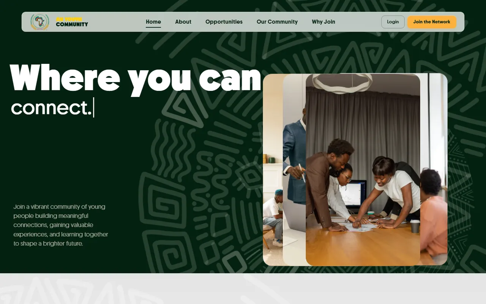
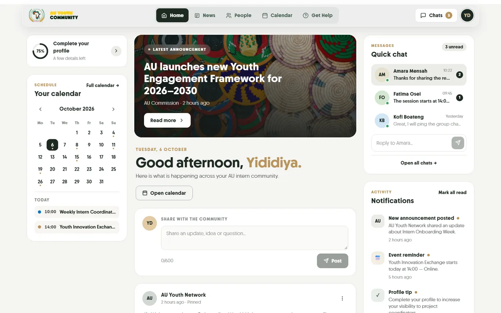
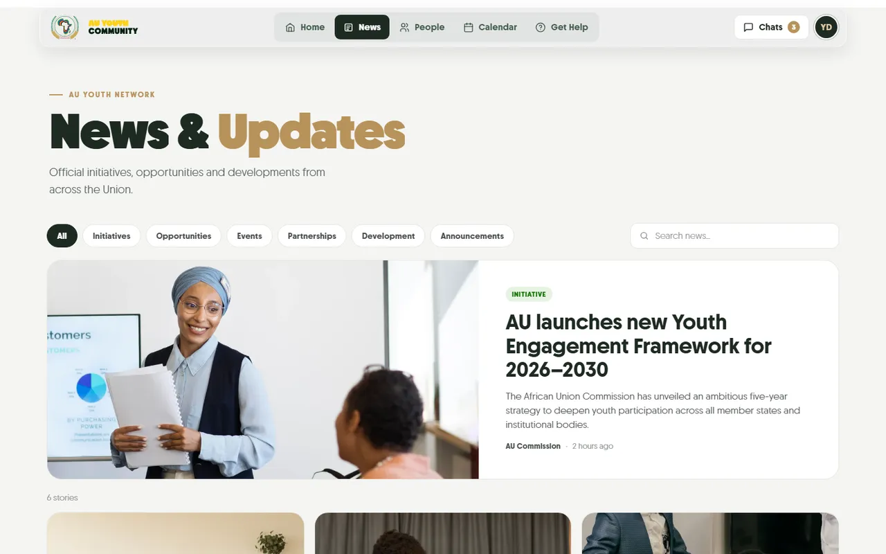
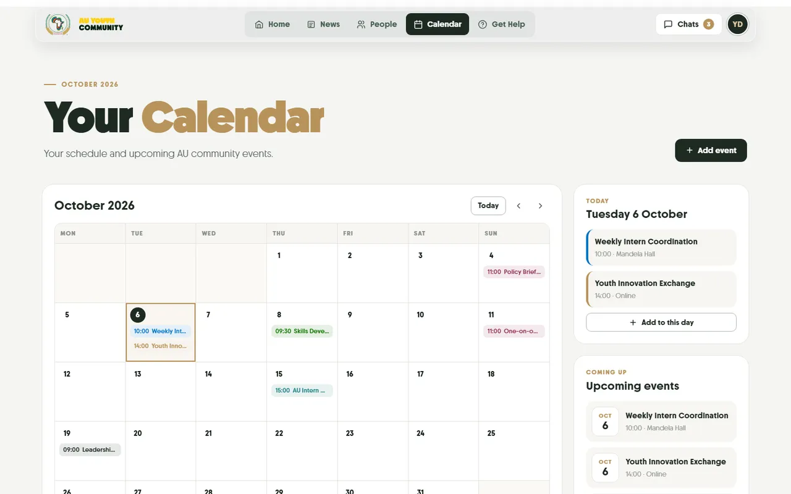
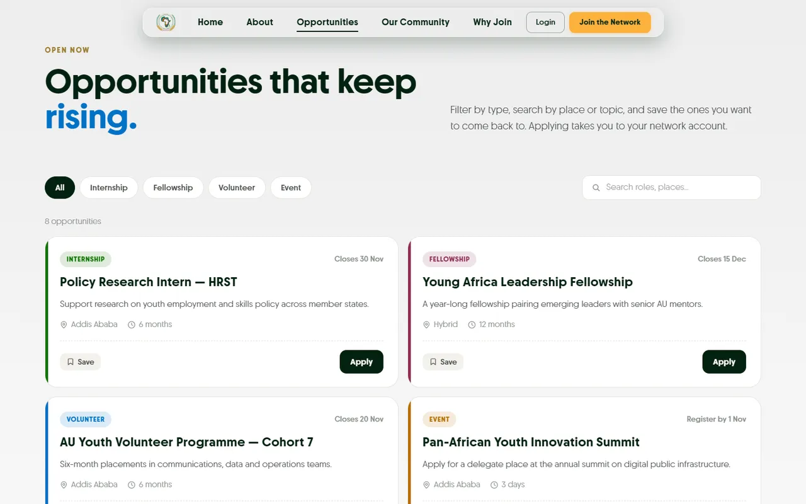
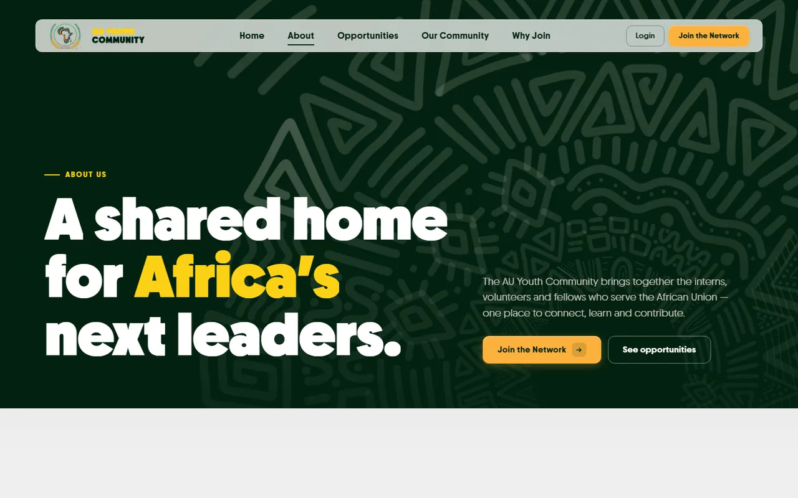
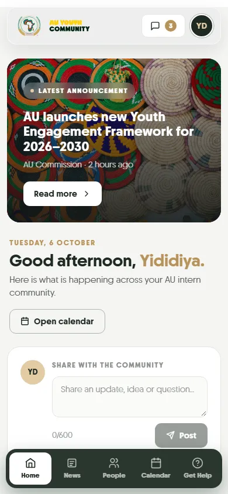
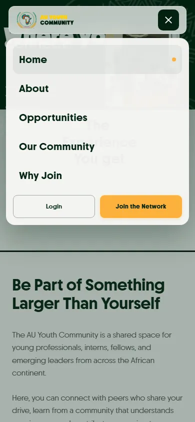

<div align="center">


# AU Youth Community

**A digital home for the African Union youth community — connect, learn and contribute.**

[](https://nextjs.org)
[](https://react.dev)
[](https://www.typescriptlang.org)
[](https://gsap.com)
[](https://lenis.darkroom.engineering)
[](DEPLOY.md)



</div>

---

## Contents

- [Overview](#overview)
- [Features](#features)
- [Screenshots](#screenshots)
- [Tech stack](#tech-stack)
- [Getting started](#getting-started)
- [Project structure](#project-structure)
- [Routes](#routes)
- [Design system](#design-system)
- [Deployment](#deployment)
- [Contributing & AI agents](#contributing--ai-agents)
- [Roadmap](#roadmap)
- [Credits](#credits)

---

## Overview

Thousands of young Africans serve with African Union institutions every year, and too often the
connections and knowledge they build leave with them. **AU Youth Community** gives every cohort
one shared place to find each other, discover opportunities, share ideas and stay connected after
their placement ends.

The project has two parts:

| | |
|---|---|
| **Public website** | A bold, animated site introducing the community: who it's for, what it offers and how to join. |
| **Member dashboard** | A calm, focused portal for signed-in members: feed, news, people, calendar, chats, help and profile. |

> **Status:** front-end prototype. Authentication and a backend are not connected yet. Sign-in
> goes straight to the dashboard, and member activity is saved in the browser (`localStorage`).

---

## Features

### Public website
- **Animated home page**: typewriter hero, cards that fly from a stacked carousel into place as you
  scroll, a pinned full-screen card story and an interactive "ideas folder".
- **Smooth scrolling** with Lenis + GSAP ScrollTrigger on a single shared animation loop.
- **About, Opportunities, Our Community, Why Join** pages with split-word heading reveals.
- **Opportunity board** with type filters, search and saved roles.
- **Peer circles** you can join, member quotes, and an FAQ accordion.
- **Responsive glass nav** that compacts on scroll and turns into a slide-down menu on mobile.

### Member dashboard
- **Home**: latest announcement, personal greeting, post composer, feed with likes, comments,
  share and hide, plus notifications, upcoming events and **Quick chat** with inline replies.
- **News**: category filters, search and full article pages.
- **People**: search, role and department filters, and connection requests.
- **Calendar**: month view, day agenda and add/delete events. Events show up across the dashboard.
- **Chats**: conversations, sending messages, unread badges kept in sync with the header.
- **Get Help**: department directory (email), issue report form, AU Youth handbook and FAQs.
- **Profile**: editable bio, details and skills, with a live completion score.
- **Mobile bottom tab bar** and a layout that adapts down to 390px wide.

### Quality
- TypeScript throughout; type-check, lint and production build all pass.
- Respects `prefers-reduced-motion`; keyboard focus styles; ARIA on toggles, menus and dialogs.
- Optimised images: WebP photos, about 95% smaller than the originals.

---

## Screenshots

| Dashboard | News |
|---|---|
|  |  |
| **Calendar** | **Opportunities** |
|  |  |
| **About** | **Mobile** |
|  |   |

---

## Tech stack

| Layer | Tools |
|---|---|
| Framework | [Next.js 14](https://nextjs.org) (App Router), [React 18](https://react.dev) |
| Language | [TypeScript 5](https://www.typescriptlang.org) |
| Styling | CSS Modules, design tokens in `app/globals.css` |
| Animation | [GSAP 3](https://gsap.com) + ScrollTrigger, [Lenis](https://lenis.darkroom.engineering) smooth scroll |
| Typeface | Chopin (self-hosted, `public/assets/fonts`) |
| Hosting | [Render](https://render.com) (`render.yaml`) |

---

## Getting started

**Requirements:** Node.js **20** (see `.node-version`) and npm.

```bash
# 1. Clone
git clone https://github.com/JoshuaMinase/AU-YOUTH.git
cd AU-YOUTH

# 2. Install dependencies
npm install

# 3. Run the dev server
npm run dev
```

Open <http://localhost:3000>. To see the member area, open `/dashboard` or sign in with any email
and password on `/login`.

### Scripts

| Command | What it does |
|---|---|
| `npm run dev` | Start the development server |
| `npm run build` | Create a production build |
| `npm start` | Serve the production build |
| `npm run lint` | Run ESLint |
| `npx tsc --noEmit` | Type-check the project |

> Don't run `npm run build` while `npm run dev` is running from the same folder. Both write to `.next/`.

---

## Project structure

```
app/                     Routes (Next.js App Router)
  page.tsx               Home
  about/ opportunities/ community/ why-join/   Public pages
  login/ sign-up/        Auth screens
  dashboard/             Member portal (layout + 7 pages, news/[slug])
components/
  SmoothScroll.tsx       Single site-wide Lenis instance
  Nav.tsx, Footer.tsx    Public navigation & footer
  Landing.tsx …          Home page sections
  site/                  Public-page building blocks (hero, CTA, FAQ, boards)
  portal/                Dashboard building blocks (icons, hero, modal, calendar)
lib/
  data.ts                Mock data, date helpers, profile model
  hooks.ts               Reveal animations, client-only "today", helpers
  store.ts               Persisted state shared between components
  portal.ts              Shared dashboard state (events, chats)
styles/                  CSS Modules (Site, Portal, Nav, Footer, …)
public/assets/           Logo, wordmark, patterns, photos, fonts
docs/screenshots/        Images used in this README
AGENTS.md                Engineering & design rules (read before contributing)
```

---

## Routes

| Route | Page |
|---|---|
| `/` | Home |
| `/about` | About the community |
| `/opportunities` | Opportunity board |
| `/community` | Circles, photos and member voices |
| `/why-join` | Benefits and FAQ |
| `/login`, `/sign-up` | Authentication (prototype) |
| `/dashboard` | Member home |
| `/dashboard/news`, `/dashboard/news/[slug]` | News list and articles |
| `/dashboard/people` | Member directory |
| `/dashboard/calendar` | Calendar |
| `/dashboard/chats` | Messages |
| `/dashboard/get-help` | Support |
| `/dashboard/profile` | Profile |

---

## Design system

The two parts of the product deliberately feel different:

| | Public website | Member dashboard |
|---|---|---|
| Mood | Bold, celebratory | Calm, neutral, focused |
| Base | AU green `#032210` with the AU pattern | Soft grey `#F5F5F3`, white cards |
| Text | White / `#032210` | Near-black green `#1E2A22` |
| Accent | AU yellow `#FCD116`, amber `#FBB13C` | Bronze `#B8935A`, used sparingly |
| Colour cards | Teal `#218380` · Amber `#FBB13C` · Plum `#8F2D56` · Sky `#73D2DE` | Light tints only |

Shared across both: the **Chopin** typeface, 22px card radius, uppercase eyebrows, and a single
easing curve (`cubic-bezier(.22,.9,.32,1)`). The full rules are in [AGENTS.md](AGENTS.md#7-design-system).

---

## Deployment

The repo includes a Render blueprint. In short:

1. Push to GitHub.
2. On [Render](https://dashboard.render.com): **New → Blueprint**, then pick this repository.
3. Render reads `render.yaml`, builds with `npm install && npm run build` and starts with `npm start`.

No environment variables are required. See [DEPLOY.md](DEPLOY.md) for the step-by-step guide.

---

## Contributing & AI agents

Please read **[AGENTS.md](AGENTS.md)** before making changes. It is the project's rulebook for
humans and AI coding agents alike. It covers the folder map, the animation and scroll rules that keep
the site smooth, the design palettes, data and state conventions, accessibility, and a pre-merge
checklist.

Before opening a pull request:

```bash
npx tsc --noEmit && npm run lint && npm run build
```

---

## Roadmap

- [ ] Real authentication and user accounts
- [ ] Backend API and database (replace `lib/data.ts` / `localStorage`)
- [ ] Live chat and notifications
- [ ] Admin tools for departments to post news and opportunities
- [ ] Multilingual content (English, French, Arabic, Portuguese, Swahili)

---

## Credits

- [Basket photograph](https://unsplash.com/photos/Pez23wGG1RM) by Charlotte Harrison on Unsplash.
- Chopin typeface (trial version). A commercial licence is required for production use.
- Built with Next.js, GSAP and Lenis.

<div align="center">
<sub>© 2026 AU Youth Community. African Union branding belongs to the African Union.</sub>
</div>
